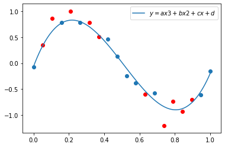
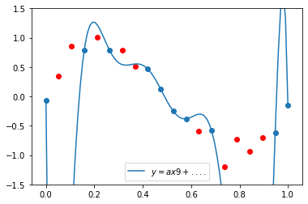
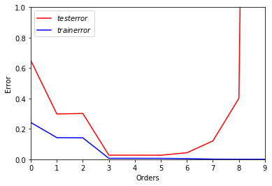
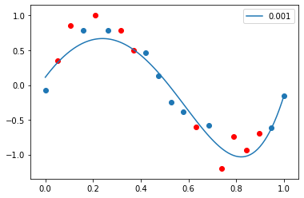
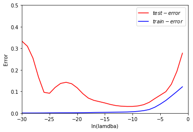

# Assignment1 —— Polynomial regression

[A post]()

```python
import numpy as np
import matplotlib.pyplot as plt
import math
import pandas as pd
import sklearn
import prettytable as pt
import numpy as np
import tensorflow as tf

from sklearn.pipeline import Pipeline
from sklearn.linear_model import Ridge
from sklearn.preprocessing import normalize,StandardScaler,PolynomialFeatures  
from sklearn import model_selection
from sklearn.linear_model import LinearRegression 
```


```python
res = {}
```

## a. Generate 20 data pairs (X, Y) using y = sin(2\*pi\*X) + N 


```python
x_sin = np.linspace(0,1,200)
x = np.linspace(0,1,20)
d = np.random.normal(loc=0,scale=0.2,size=20)    # N from the normal gaussian distribution 
print(d)
y_sin = 2*math.pi*x_sin
y = 2*math.pi*x
print(y)
for i in range(200):
    y_sin[i] = math.sin(y_sin[i])    
for i in range(20):
    y[i] = math.sin(y[i])+ d[i]
```

    [-0.06889813  0.02674846  0.24665862 -0.05187796  0.03988177 -0.21398366
     -0.13006871 -0.23040466 -0.00998632 -0.03663616 -0.08745814  0.0947099
      0.1376655   0.33446974 -0.20939689  0.23393522 -0.10303335 -0.08627464
     -0.29465245 -0.15252956]
    [0.         0.33069396 0.66138793 0.99208189 1.32277585 1.65346982
     1.98416378 2.31485774 2.64555171 2.97624567 3.30693964 3.6376336
     3.96832756 4.29902153 4.62971549 4.96040945 5.29110342 5.62179738
     5.95249134 6.28318531]


```python
plt.plot(x_sin, y_sin, "r-")  # original sin function curve
plt.scatter(x, y)
```


    <matplotlib.collections.PathCollection at 0x1a435fecd0>


```python
data_1 = {'X':x, 'Y':y}
data = pd.DataFrame(data = data_1, dtype=np.int8)
data
```


<div>
<style scoped>
    .dataframe tbody tr th:only-of-type {
        vertical-align: middle;
    }

    .dataframe tbody tr th {
        vertical-align: top;
    }

    .dataframe thead th {
        text-align: right;
    }
</style>
<table border="1" class="dataframe">
  <thead>
    <tr style="text-align: right;">
      <th></th>
      <th>X</th>
      <th>Y</th>
    </tr>
  </thead>
  <tbody>
    <tr>
      <th>0</th>
      <td>0.000000</td>
      <td>-0.068898</td>
    </tr>
    <tr>
      <th>1</th>
      <td>0.052632</td>
      <td>0.351448</td>
    </tr>
    <tr>
      <th>2</th>
      <td>0.105263</td>
      <td>0.860871</td>
    </tr>
    <tr>
      <th>3</th>
      <td>0.157895</td>
      <td>0.785289</td>
    </tr>
    <tr>
      <th>4</th>
      <td>0.210526</td>
      <td>1.009282</td>
    </tr>
    <tr>
      <th>5</th>
      <td>0.263158</td>
      <td>0.782601</td>
    </tr>
    <tr>
      <th>6</th>
      <td>0.315789</td>
      <td>0.785705</td>
    </tr>
    <tr>
      <th>7</th>
      <td>0.368421</td>
      <td>0.505319</td>
    </tr>
    <tr>
      <th>8</th>
      <td>0.421053</td>
      <td>0.465961</td>
    </tr>
    <tr>
      <th>9</th>
      <td>0.473684</td>
      <td>0.127958</td>
    </tr>
    <tr>
      <th>10</th>
      <td>0.526316</td>
      <td>-0.252053</td>
    </tr>
    <tr>
      <th>11</th>
      <td>0.578947</td>
      <td>-0.381237</td>
    </tr>
    <tr>
      <th>12</th>
      <td>0.631579</td>
      <td>-0.598058</td>
    </tr>
    <tr>
      <th>13</th>
      <td>0.684211</td>
      <td>-0.581304</td>
    </tr>
    <tr>
      <th>14</th>
      <td>0.736842</td>
      <td>-1.205981</td>
    </tr>
    <tr>
      <th>15</th>
      <td>0.789474</td>
      <td>-0.735465</td>
    </tr>
    <tr>
      <th>16</th>
      <td>0.842105</td>
      <td>-0.940200</td>
    </tr>
    <tr>
      <th>17</th>
      <td>0.894737</td>
      <td>-0.700487</td>
    </tr>
    <tr>
      <th>18</th>
      <td>0.947368</td>
      <td>-0.619352</td>
    </tr>
    <tr>
      <th>19</th>
      <td>1.000000</td>
      <td>-0.152530</td>
    </tr>
  </tbody>
</table>
</div>


```python
X_train,X_test, Y_train, Y_test =model_selection.train_test_split(x, y, test_size=0.5, random_state=3)
```


```python
train = {'X':X_train, 'Y': Y_train}
train_data = pd.DataFrame(data = train, dtype=np.int8)
train_data
```


<div>
<style scoped>
    .dataframe tbody tr th:only-of-type {
        vertical-align: middle;
    }

    .dataframe tbody tr th {
        vertical-align: top;
    }

    .dataframe thead th {
        text-align: right;
    }
</style>
<table border="1" class="dataframe">
  <thead>
    <tr style="text-align: right;">
      <th></th>
      <th>X</th>
      <th>Y</th>
    </tr>
  </thead>
  <tbody>
    <tr>
      <th>0</th>
      <td>0.473684</td>
      <td>0.127958</td>
    </tr>
    <tr>
      <th>1</th>
      <td>0.578947</td>
      <td>-0.381237</td>
    </tr>
    <tr>
      <th>2</th>
      <td>1.000000</td>
      <td>-0.152530</td>
    </tr>
    <tr>
      <th>3</th>
      <td>0.947368</td>
      <td>-0.619352</td>
    </tr>
    <tr>
      <th>4</th>
      <td>0.684211</td>
      <td>-0.581304</td>
    </tr>
    <tr>
      <th>5</th>
      <td>0.263158</td>
      <td>0.782601</td>
    </tr>
    <tr>
      <th>6</th>
      <td>0.000000</td>
      <td>-0.068898</td>
    </tr>
    <tr>
      <th>7</th>
      <td>0.421053</td>
      <td>0.465961</td>
    </tr>
    <tr>
      <th>8</th>
      <td>0.157895</td>
      <td>0.785289</td>
    </tr>
    <tr>
      <th>9</th>
      <td>0.526316</td>
      <td>-0.252053</td>
    </tr>
  </tbody>
</table>
</div>


```python
test = {'X':X_test, 'Y': Y_test}
test_data = pd.DataFrame(data = test, dtype=np.int8)
test_data
```


<div>
<style scoped>
    .dataframe tbody tr th:only-of-type {
        vertical-align: middle;
    }

    .dataframe tbody tr th {
        vertical-align: top;
    }

    .dataframe thead th {
        text-align: right;
    }
</style>
<table border="1" class="dataframe">
  <thead>
    <tr style="text-align: right;">
      <th></th>
      <th>X</th>
      <th>Y</th>
    </tr>
  </thead>
  <tbody>
    <tr>
      <th>0</th>
      <td>0.736842</td>
      <td>-1.205981</td>
    </tr>
    <tr>
      <th>1</th>
      <td>0.105263</td>
      <td>0.860871</td>
    </tr>
    <tr>
      <th>2</th>
      <td>0.052632</td>
      <td>0.351448</td>
    </tr>
    <tr>
      <th>3</th>
      <td>0.894737</td>
      <td>-0.700487</td>
    </tr>
    <tr>
      <th>4</th>
      <td>0.210526</td>
      <td>1.009282</td>
    </tr>
    <tr>
      <th>5</th>
      <td>0.842105</td>
      <td>-0.940200</td>
    </tr>
    <tr>
      <th>6</th>
      <td>0.315789</td>
      <td>0.785705</td>
    </tr>
    <tr>
      <th>7</th>
      <td>0.368421</td>
      <td>0.505319</td>
    </tr>
    <tr>
      <th>8</th>
      <td>0.789474</td>
      <td>-0.735465</td>
    </tr>
    <tr>
      <th>9</th>
      <td>0.631579</td>
      <td>-0.598058</td>
    </tr>
  </tbody>
</table>
</div>


```python
plt.scatter(X_train, Y_train)
plt.scatter(X_test, Y_test, c = 'r')
```


    <matplotlib.collections.PathCollection at 0x1a43793a10>


## b. Using room mean square error, find weights of polynomial regression for order is 0, 1, 3, 9


```python
def  polynomialRegression(i:int ) :
    polynomial = PolynomialFeatures(degree = i)# quadratic polynomial
    x_transformed = polynomial.fit_transform(X_train.reshape(10,1))
    poly_linear_model = LinearRegression()
    poly_linear_model.fit(x_transformed, Y_train)# train
    return polynomial, poly_linear_model
```

### weights of polynomial regression for order is 0


```python
polynomial_0, poly_linear_model_0 = polynomialRegression(0) 

coef = poly_linear_model_0.coef_
tmp = [0]*10
for i in range(len(coef)) :
    tmp[i] = int(coef[i])
res['0'] = tmp
coef
```


    array([0.])


### weights of polynomial regression for order is 1


```python

polynomial_1, poly_linear_model_1 = polynomialRegression(1)
 
coef = poly_linear_model_1.coef_
tmp = [0]*10
for i in range(len(coef)) :
    tmp[i] = int(coef[i])
res['1'] = tmp
coef
```


    array([ 0.        , -1.03980292])


### weights of polynomial regression for order is 3


```python
polynomial_3, poly_linear_model_3 = polynomialRegression(3)
 
coef = poly_linear_model_3.coef_
tmp = [0]*10
for i in range(len(coef)) :
    tmp[i] = int(coef[i])
res['3'] = tmp
coef
```


    array([  0.        ,   9.05355623, -26.39654147,  17.21077736])


### weights of polynomial regression for order is 9


```python
polynomial_9, poly_linear_model_9 = polynomialRegression(9)
coef = poly_linear_model_9.coef_
tmp = [0]*10
for i in range(len(coef)) :
    tmp[i] = int(coef[i])
res['9'] = tmp
coef
```


    array([ 0.00000000e+00, -4.40001497e+02,  9.05594258e+03, -7.51956543e+04,
            3.35616148e+05, -8.87788711e+05,  1.43224233e+06, -1.38140936e+06,
            7.30679050e+05, -1.62759822e+05])


## c. Display weights in table 


```python
from prettytable import PrettyTable
x= PrettyTable()
x.add_column("label\order", ["W0","W1","W2","W3","W4","W5","W6","W7","W8","W9"])
x.add_column("0", res["0"])
x.add_column("1", res["1"])
x.add_column("3", res["3"])
x.add_column("9", res["9"])
print(x)
# the label 0, W0 in the table is the weights of polynomial regression for order is 0
# the label 1, W0 and W1 in the table is the weights of polynomial regression for order is 1
# the label 3, W0, W1, W2 and W3 in the table is the weights of polynomial regression for order is 3
# the label 9, W0-W9 in the table is the weights of polynomial regression for order is 9
```

    +-------------+---+----+-----+----------+
    | label\order | 0 | 1  |  3  |    9     |
    +-------------+---+----+-----+----------+
    |      W0     | 0 | 0  |  0  |    0     |
    |      W1     | 0 | -1 |  9  |   -440   |
    |      W2     | 0 | 0  | -26 |   9055   |
    |      W3     | 0 | 0  |  17 |  -75195  |
    |      W4     | 0 | 0  |  0  |  335616  |
    |      W5     | 0 | 0  |  0  | -887788  |
    |      W6     | 0 | 0  |  0  | 1432242  |
    |      W7     | 0 | 0  |  0  | -1381409 |
    |      W8     | 0 | 0  |  0  |  730679  |
    |      W9     | 0 | 0  |  0  | -162759  |
    +-------------+---+----+-----+----------+


## d. Draw a chart of fit data
### weights of polynomial regression for order is 0


```python
xx = np.linspace(0, 1, 100)
xx_transformed_0 = polynomial_0.fit_transform(xx.reshape(xx.shape[0], 1))
yy = poly_linear_model_0.predict(xx_transformed_0)
plt.plot(xx, yy,label="$y = N$")
plt.scatter(X_train, Y_train)
plt.scatter(X_test, Y_test, c = 'r')
plt.legend()
```


    <matplotlib.legend.Legend at 0x1a437dee10>


### weights of polynomial regression for order is 1


```python
xx = np.linspace(0, 1, 100)
xx_transformed_1 = polynomial_1.fit_transform(xx.reshape(xx.shape[0], 1))
yy = poly_linear_model_1.predict(xx_transformed_1)
plt.plot(xx, yy,label="$y = ax$")
plt.scatter(X_train, Y_train)
plt.scatter(X_test, Y_test, c = 'r')
plt.legend()
```


    <matplotlib.legend.Legend at 0x1a438c0c10>


### weights of polynomial regression for order is 3


```python
xx = np.linspace(0, 1, 100)
xx_transformed_3 = polynomial_3.fit_transform(xx.reshape(xx.shape[0], 1))
yy = poly_linear_model_3.predict(xx_transformed_3)
plt.plot(xx, yy,label="$y = ax3+bx2+cx+d$")
plt.scatter(X_train, Y_train)
plt.scatter(X_test, Y_test, c = 'r')
plt.legend()
```


    <matplotlib.legend.Legend at 0x1a43a8a390>





### weights of polynomial regression for order is 9


```python
xx = np.linspace(0, 1, 100)
xx_transformed_9 = polynomial_9.fit_transform(xx.reshape(xx.shape[0], 1))
yy = poly_linear_model_9.predict(xx_transformed_9)
plt.plot(xx, yy,label="$y = ax9+....$")
plt.scatter(X_train, Y_train)
plt.scatter(X_test, Y_test, c = 'r')
plt.ylim(-1.5 ,1.5)
plt.legend()
```


    <matplotlib.legend.Legend at 0x1a43bede90>





## e. Draw train error vs test error


```python
train_error = [0]*10     #train error
test_error = [0]*10      #test error
```


```python
def getMse(Y, yy):
    standard = tf.square(Y - yy)
    mse = tf.reduce_mean(standard)
    return mse.numpy()
```


```python
def getError(i:int,  model) :
    polynomial = PolynomialFeatures(degree = i)
    xx_transformed_test = polynomial.fit_transform(X_test.reshape(X_test.shape[0], 1))
    xx_transformed_train = polynomial.fit_transform(X_train.reshape(X_test.shape[0], 1))
    yy_test = model.predict(xx_transformed_test)
    yy_train = model.predict(xx_transformed_train)

    test_error[i] = getMse(Y_test, yy_test)

    train_error[i] = getMse(Y_train, yy_train)
```


```python
polynomial_2, poly_linear_model_2 = polynomialRegression(2)
polynomial_4, poly_linear_model_4 = polynomialRegression(4)
polynomial_5, poly_linear_model_5 = polynomialRegression(5)
polynomial_6, poly_linear_model_6 = polynomialRegression(6)
polynomial_7, poly_linear_model_7 = polynomialRegression(7)
polynomial_8, poly_linear_model_8 = polynomialRegression(8)
# 0,1,3,9 I used the model fitted before.
getError(0, poly_linear_model_0)
getError(1, poly_linear_model_1)
getError(2, poly_linear_model_2)
getError(3, poly_linear_model_3)
getError(4, poly_linear_model_4)
getError(5, poly_linear_model_5)
getError(6, poly_linear_model_6)
getError(7, poly_linear_model_7)
getError(8, poly_linear_model_8)
getError(9, poly_linear_model_9)

print(test_error)
print(train_error)
```

    [0.6498920057761227, 0.29804783140365465, 0.30113805806870736, 0.02726799080902726, 0.0271024086195014, 0.026776756066662428, 0.04301676452676815, 0.12082159598343782, 0.401395880004449, 14.044977128617717]
    [0.24198978400252188, 0.14243643318053872, 0.14127787295342403, 0.006370123295882909, 0.006346077518346089, 0.0061639660337249, 0.004435216402598326, 0.0008846725534367012, 0.00025564239293912985, 3.1460399327300388e-21]


```python
xx = np.linspace(0, 9, 10)
plt.ylim(0 ,1)
plt.xlim(0,9)
plt.plot(xx, test_error, label = "$test error$", c = 'r')
plt.plot(xx, train_error, label = "$train error$", c = 'b')

plt.xlabel('Orders')

plt.ylabel('Error')
plt.legend()
```


    <matplotlib.legend.Legend at 0x1a43c40190>





## f. Generate 100 more data and fit 9th order model and draw fit


```python
x_100 = np.linspace(0,1,100)     # Gegerate new 100 samples
d_100 = np.random.normal(loc=0,scale=0.2,size=100)    # N from the normal gaussian distribution 
y_100 = 2*math.pi*x_100
for i in range(100):
    y_100[i] = math.sin(y_100[i])+ d_100[i]
data_1 = {'X':x_100, 'Y':y_100}
data_100 = pd.DataFrame(data = data_1, dtype=np.int8)
data_100
```


<div>
<style scoped>
    .dataframe tbody tr th:only-of-type {
        vertical-align: middle;
    }

    .dataframe tbody tr th {
        vertical-align: top;
    }

    .dataframe thead th {
        text-align: right;
    }
</style>
<table border="1" class="dataframe">
  <thead>
    <tr style="text-align: right;">
      <th></th>
      <th>X</th>
      <th>Y</th>
    </tr>
  </thead>
  <tbody>
    <tr>
      <th>0</th>
      <td>0.000000</td>
      <td>0.204449</td>
    </tr>
    <tr>
      <th>1</th>
      <td>0.010101</td>
      <td>0.294845</td>
    </tr>
    <tr>
      <th>2</th>
      <td>0.020202</td>
      <td>0.059705</td>
    </tr>
    <tr>
      <th>3</th>
      <td>0.030303</td>
      <td>0.599017</td>
    </tr>
    <tr>
      <th>4</th>
      <td>0.040404</td>
      <td>-0.021195</td>
    </tr>
    <tr>
      <th>...</th>
      <td>...</td>
      <td>...</td>
    </tr>
    <tr>
      <th>95</th>
      <td>0.959596</td>
      <td>-0.388439</td>
    </tr>
    <tr>
      <th>96</th>
      <td>0.969697</td>
      <td>0.484030</td>
    </tr>
    <tr>
      <th>97</th>
      <td>0.979798</td>
      <td>-0.015679</td>
    </tr>
    <tr>
      <th>98</th>
      <td>0.989899</td>
      <td>0.012487</td>
    </tr>
    <tr>
      <th>99</th>
      <td>1.000000</td>
      <td>0.029097</td>
    </tr>
  </tbody>
</table>
<p>100 rows × 2 columns</p>
</div>


```python
plt.scatter(x_100, y_100, marker = "o",c = "r")
```


    <matplotlib.collections.PathCollection at 0x1a43ca1290>


```python
polynomial = PolynomialFeatures(degree = 9)# quadratic polynomial
x_transformed = polynomial.fit_transform(x_100.reshape(100,1))
poly_linear_model = LinearRegression()
poly_linear_model.fit(x_transformed, y_100)# train

xx_transformed_9 = polynomial.fit_transform(x_100.reshape(x_100.shape[0], 1))
yy = poly_linear_model.predict(xx_transformed_9)
plt.plot(x_100, yy,label="$y = ax9+.....$")
plt.scatter(x_100, y_100, c = "r")
plt.legend()
```


    <matplotlib.legend.Legend at 0x1a43f87890>


## g. Regularize using the sum of weights. 
## h. Draw chart for lamda


```python
def regularizeRidge(alpha):
    if alpha < 0: alpha = math.exp(alpha)    # easy to calculate lambda. if lambda < 0, we calculate it as ln(lambda).
    else:
        print("alpha = ",alpha)
        if alpha != 0: print("ln(alpha) = ", math.log(alpha))
    polynomial = PolynomialFeatures(degree = 9)# quadratic polynomial
    x_transformed = polynomial.fit_transform(X_train.reshape(10,1))
    poly_linear_model = Ridge(alpha = alpha)
    poly_linear_model.fit(x_transformed, Y_train)# train

    return poly_linear_model

def chartRidge(alpha):
    model = regularizeRidge(alpha)
    xx = np.linspace(0, 1, 100)
    x_transformed = polynomial.fit_transform(xx.reshape(100,1))
    yy = model.predict(x_transformed)
    plt.plot(xx, yy,label=alpha)
    plt.scatter(X_train, Y_train)
    plt.scatter(X_test, Y_test, c = 'r')
    plt.legend()
```


```python
chartRidge(0) #, lambda = 0
```

    alpha =  0


```python
chartRidge(0.1)    #ln(lambda) =  -4.6051701860e+0, lambda = 0.1
```

    alpha =  0.1
    ln(alpha) =  -2.3025850929940455


```python
chartRidge(0.01)    #ln(lambda) = -4.605170185988091, lambda = 0.01
```

    alpha =  0.01
    ln(alpha) =  -4.605170185988091


```python
chartRidge(0.001)    #ln(lambda) = -6.907755278982137, lambda = 0.001
```

    alpha =  0.001
    ln(alpha) =  -6.907755278982137


```python
chartRidge(0.0001)    #ln(lambda) = -9.210340371976182, lambda = 0.0001
```

    alpha =  0.0001
    ln(alpha) =  -9.210340371976182





## i. Draw test  and train error according to lamda 


```python
train_error_ridge = np.zeros(30)
test_error_ridge = np.zeros(30)

def getErrorRidge(i:int,  model) :     # A new error function
    xx_transformed_test = polynomial.fit_transform(X_test.reshape(X_test.shape[0], 1))
    xx_transformed_train = polynomial.fit_transform(X_train.reshape(X_train.shape[0], 1))
    yy_test = model.predict(xx_transformed_test)
    yy_train = model.predict(xx_transformed_train)
    test_error_ridge[i] = getMse(Y_test, yy_test)
    train_error_ridge[i] = getMse(Y_train, yy_train)
```


```python
xx = list(range(-30, 0))
for i in xx:
    model = regularizeRidge(i)
    getErrorRidge(i, model)
```


```python
xx = list(range(-30, 0))
plt.ylim(0 ,0.5)
plt.xlim(-30,0)
plt.plot(xx, test_error_ridge, label = "$test-error$", c = 'r')
plt.plot(xx, train_error_ridge, label = "$train-error$", c = 'b')

plt.xlabel('ln(lamdba)')

plt.ylabel('Error')
plt.legend()
```


    <matplotlib.legend.Legend at 0x1a4401ad50>





```python
#   get the best lambda
best_lambda = 0
for i in range(-30,0):
    if test_error_ridge[i+30] == test_error_ridge.min(): best_lambda = i
print("best ln(lambda) = ", best_lambda)
best_lambda_0 = math.exp(best_lambda)
print("best lambda = ", best_lambda_0)
print("In summary, the model which ln(lamdba) = ",best_lambda,", lambda = ",best_lambda_0," has the best test performance.")
  
```

    best ln(lambda) =  -11
    best lambda =  1.670170079024566e-05
    In summary, the model which ln(lamdba) =  -11 , lambda =  1.670170079024566e-05  has the best test performance.

