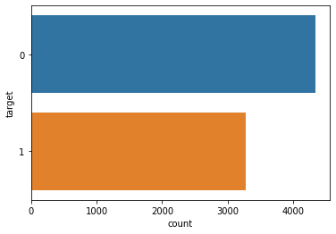
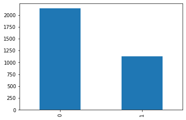

# Real or Not? NLP with Disaster Tweets   
Predict which Tweets are about real disasters and which ones are not

environment:   
tensorflow 2.2.0  
karas 2.3.1   
sklearn 0.22.1   
platform: 
I7-9700k GTX-1080ti


```python
from IPython.core.display import Image
Image('https://www.python.org/static/community_logos/python-logo-master-v3-TM-flattened.png')
```


## 1. Naive Bayes


```python
import numpy as np 
import pandas as pd 
import os
from sklearn.model_selection import train_test_split
from sklearn.feature_extraction.text import CountVectorizer
from sklearn.naive_bayes import MultinomialNB
from sklearn.metrics import accuracy_score
from sklearn.metrics import confusion_matrix
import seaborn as sns
```

### Input data
../train.csv                  7613   
../test.csv                   3263   
../sample_submission.csv      3263   


```python
train_df = pd.read_csv("../train.csv")
test_df = pd.read_csv("../test.csv")
sub_df = pd.read_csv("../sample_submission.csv")
print (train_df.shape, test_df.shape, sub_df.shape)
# (7613, 5) (3263, 4) (3263, 2)
```

    (7613, 5) (3263, 4) (3263, 2)


```python
train_df.head()
```


<div>
<style scoped>
    .dataframe tbody tr th:only-of-type {
        vertical-align: middle;
    }

    .dataframe tbody tr th {
        vertical-align: top;
    }

    .dataframe thead th {
        text-align: right;
    }
</style>
<table border="1" class="dataframe">
  <thead>
    <tr style="text-align: right;">
      <th></th>
      <th>id</th>
      <th>keyword</th>
      <th>location</th>
      <th>text</th>
      <th>target</th>
    </tr>
  </thead>
  <tbody>
    <tr>
      <th>0</th>
      <td>1</td>
      <td>NaN</td>
      <td>NaN</td>
      <td>Our Deeds are the Reason of this #earthquake M...</td>
      <td>1</td>
    </tr>
    <tr>
      <th>1</th>
      <td>4</td>
      <td>NaN</td>
      <td>NaN</td>
      <td>Forest fire near La Ronge Sask. Canada</td>
      <td>1</td>
    </tr>
    <tr>
      <th>2</th>
      <td>5</td>
      <td>NaN</td>
      <td>NaN</td>
      <td>All residents asked to 'shelter in place' are ...</td>
      <td>1</td>
    </tr>
    <tr>
      <th>3</th>
      <td>6</td>
      <td>NaN</td>
      <td>NaN</td>
      <td>13,000 people receive #wildfires evacuation or...</td>
      <td>1</td>
    </tr>
    <tr>
      <th>4</th>
      <td>7</td>
      <td>NaN</td>
      <td>NaN</td>
      <td>Just got sent this photo from Ruby #Alaska as ...</td>
      <td>1</td>
    </tr>
  </tbody>
</table>
</div>


### There is no duplicated data


```python
train_df.duplicated().sum()
```


    0


### The train set distribution


```python
train_df = train_df.drop_duplicates().reset_index(drop=True)
sns.countplot(y=train_df.target);
train_df.target.value_counts()
```


    0    4342
    1    3271
    Name: target, dtype: int64





### Separate the train.csv into 80% train data and 20% test data.


```python
x = train_df["text"]
y = train_df["target"]


# Separate the train.csv into 80% train data and 20% test data.
X_train, X_test, y_train, y_test = train_test_split(x, y, test_size=0.2, random_state=42)
```


```python
X_train.head()
```


    4996    Courageous and honest analysis of need to use ...
    3263    @ZachZaidman @670TheScore wld b a shame if tha...
    4907    Tell @BarackObama to rescind medals of 'honor'...
    2855    Worried about how the CA drought might affect ...
    4716    @YoungHeroesID Lava Blast &amp; Power Red #Pan...
    Name: text, dtype: object


### Get stopword in sklearn.   
CountVectorizer(stop_words = 'english')


```python
# Get stopword in sklearn.
vect = CountVectorizer(stop_words = 'english')

x_train_cv = vect.fit_transform(X_train)
x_test_cv = vect.transform(X_test)
vect
```


    CountVectorizer(analyzer='word', binary=False, decode_error='strict',
                    dtype=<class 'numpy.int64'>, encoding='utf-8', input='content',
                    lowercase=True, max_df=1.0, max_features=None, min_df=1,
                    ngram_range=(1, 1), preprocessor=None, stop_words='english',
                    strip_accents=None, token_pattern='(?u)\\b\\w\\w+\\b',
                    tokenizer=None, vocabulary=None)


```python
# sklearn.naive_bayes.MultinomialNB
clf = MultinomialNB()
clf.fit(x_train_cv, y_train)
```


    MultinomialNB(alpha=1.0, class_prior=None, fit_prior=True)


```python
pred = clf.predict(x_test_cv)
```


```python
accuracy_score(y_test,pred)
# 0.7872619829284307
# kaggle score: 0.80163
```


    0.7872619829284307


```python
# output "submission_bayes.csv"
y_test = test_df["text"]
y_test_cv = vect.transform(y_test)
preds = clf.predict(y_test_cv)
sub_df["target"] = preds
sub_df.to_csv("submission_bayes.csv",index=False)
```

# 2. Bi-LSTM  
Using glove-twitter-27B vector representation of word.  
Bi-LSTM model
new version of tensorflow should use layers in tensorflow.keras 


```python
import keras
import tensorflow as tf

from keras.layers import (LSTM, 
                          Embedding, 
                          BatchNormalization,
                          Dense, 
                          TimeDistributed, 
                          Dropout, 
                          Bidirectional,
                          Flatten, 
                          GlobalMaxPool1D)
from keras.models import Sequential
from keras.initializers import Constant

# new version of tensorflow should use layers in tensorflow.keras 
from tensorflow.keras import layers

from nltk.tokenize import word_tokenize
from keras.preprocessing.text import Tokenizer
from keras.preprocessing.sequence import pad_sequences
from keras.layers.embeddings import Embedding
from keras.callbacks import ModelCheckpoint, ReduceLROnPlateau
from keras.optimizers import Adam


from sklearn.metrics import (
    precision_score, 
    recall_score, 
    f1_score, 
    classification_report,
    accuracy_score
)

import matplotlib.pyplot as plt
from sklearn.model_selection import train_test_split
```

    Using TensorFlow backend.


```python
tf.test.is_gpu_available()
```

    WARNING:tensorflow:From <ipython-input-14-17bb7203622b>:1: is_gpu_available (from tensorflow.python.framework.test_util) is deprecated and will be removed in a future version.
    Instructions for updating:
    Use `tf.config.list_physical_devices('GPU')` instead.


    True


```python
keras.__version__
```


    '2.3.1'


```python
train = train_df.text.values
test = test_df.text.values
sentiments = train_df.target.values
```


```python
word_tokenizer = Tokenizer()
word_tokenizer.fit_on_texts(train)
vocab_length = len(word_tokenizer.word_index) + 1
```


```python
def metrics(pred_tag, y_test):

    print("F1-score: ", f1_score(pred_tag, y_test))
    print("Precision: ", precision_score(pred_tag, y_test))
    print("Recall: ", recall_score(pred_tag, y_test))
    print("Acuracy: ", accuracy_score(pred_tag, y_test))
    print("-"*50)
    print(classification_report(pred_tag, y_test))
    
def embed(corpus): 
    return word_tokenizer.texts_to_sequences(corpus)
```


```python
longest_train = max(train, key=lambda sentence: len(word_tokenize(sentence)))
length_long_sentence = len(word_tokenize(longest_train))
padded_sentences = pad_sequences(embed(train), length_long_sentence, padding='post')

test_sentences = pad_sequences(
    embed(test), 
    length_long_sentence,
    padding='post'
)
```

### glove.twitter.27B-100d.txt
Pre-trained word vectors. 


```python
# #Twitter Gloves

embeddings_dictionary = dict()
embedding_dim = 200
# glove_file = open('../input/glove-global-vectors-for-word-representation/glove.6B.' + str(embedding_dim) + 'd.txt', encoding="utf8")
glove_file = open('../../glove.twitter.27B.' + str(embedding_dim) + 'd.txt', encoding="utf8")

for line in glove_file:
    records = line.split()
    word = records[0]
    vector_dimensions = np.asarray(records[1:], dtype='float32')
    embeddings_dictionary [word] = vector_dimensions

glove_file.close()
```


```python
embedding_matrix = np.zeros((vocab_length, embedding_dim))
for word, index in word_tokenizer.word_index.items():
    if index >= vocab_length:
        continue
    embedding_vector = embeddings_dictionary.get(word)
    if embedding_vector is not None:
        embedding_matrix[index] = embedding_vector
```


```python
def BLSTM():
    model = Sequential()
    model.add(Embedding(input_dim=embedding_matrix.shape[0], 
                        output_dim=embedding_matrix.shape[1], 
                        weights = [embedding_matrix], 
                        input_length=length_long_sentence,
                        trainable=False))
    
    model.add(Bidirectional(LSTM(length_long_sentence, return_sequences = True, recurrent_dropout=0.2)))
    model.add(GlobalMaxPool1D())
    model.add(BatchNormalization())
    model.add(Dropout(0.5))
    model.add(Dense(length_long_sentence, activation = "relu"))
    model.add(Dropout(0.5))
    model.add(Dense(length_long_sentence, activation = "relu"))
    model.add(Dropout(0.5))
    model.add(Dense(1, activation = 'sigmoid'))
    model.compile(optimizer='rmsprop', loss='binary_crossentropy', metrics=['accuracy'])
    return model
```


```python

reduce_lr = ReduceLROnPlateau(
    monitor='val_loss', 
    factor=0.2, 
    verbose =1, 
    patience=5,                        
    min_lr=0.001
)

for idx in range(5):
    
    print("*"*20 + '\nModelo: ' + str(idx) + '\n')
    
    reduce_lr = ReduceLROnPlateau(
        monitor='val_loss', 
        factor=0.2, 
        verbose =1, 
        patience=5,                        
        min_lr=0.001
    )
    checkpoint = ModelCheckpoint(
        'model_' + str(idx)+ '.h5', 
        monitor='val_loss',
        mode='auto',
        verbose=1,
        save_weights_only = True,
        save_best_only=True
    )
    
    X_train, X_test, y_train, y_test = train_test_split(
        padded_sentences, 
        sentiments, 
        test_size=0.5
    )
    
    model = BLSTM()
    model.fit(X_train,
              y_train,
              batch_size=32,
              epochs=15,
              validation_data=[X_test, y_test],
              callbacks = [reduce_lr, checkpoint],
              verbose=1)
```

    ********************
    Modelo: 0
    
    Train on 3806 samples, validate on 3807 samples
    Epoch 1/15
    3806/3806 [==============================] - 22s 6ms/step - loss: 0.7081 - accuracy: 0.6432 - val_loss: 0.6185 - val_accuracy: 0.6961
    
    Epoch 00001: val_loss improved from inf to 0.61854, saving model to model_0.h5
    Epoch 2/15
    3806/3806 [==============================] - 21s 5ms/step - loss: 0.5423 - accuracy: 0.7520 - val_loss: 0.5268 - val_accuracy: 0.7896
    
    Epoch 00002: val_loss improved from 0.61854 to 0.52679, saving model to model_0.h5
    Epoch 3/15
    3806/3806 [==============================] - 20s 5ms/step - loss: 0.4821 - accuracy: 0.7909 - val_loss: 0.4769 - val_accuracy: 0.8019
    
    Epoch 00003: val_loss improved from 0.52679 to 0.47691, saving model to model_0.h5
    Epoch 4/15
    3806/3806 [==============================] - 20s 5ms/step - loss: 0.4666 - accuracy: 0.8022 - val_loss: 0.4745 - val_accuracy: 0.7857
    
    Epoch 00004: val_loss improved from 0.47691 to 0.47448, saving model to model_0.h5
    Epoch 5/15
    3806/3806 [==============================] - 20s 5ms/step - loss: 0.4343 - accuracy: 0.8234 - val_loss: 0.4209 - val_accuracy: 0.8098
    
    Epoch 00005: val_loss improved from 0.47448 to 0.42088, saving model to model_0.h5
    Epoch 6/15
    3806/3806 [==============================] - 21s 5ms/step - loss: 0.4142 - accuracy: 0.8242 - val_loss: 0.4310 - val_accuracy: 0.8033
    
    Epoch 00006: val_loss did not improve from 0.42088
    Epoch 7/15
    3806/3806 [==============================] - 20s 5ms/step - loss: 0.3995 - accuracy: 0.8334 - val_loss: 0.4263 - val_accuracy: 0.8088
    
    Epoch 00007: val_loss did not improve from 0.42088
    Epoch 8/15
    3806/3806 [==============================] - 20s 5ms/step - loss: 0.3902 - accuracy: 0.8387 - val_loss: 0.4179 - val_accuracy: 0.8140
    
    Epoch 00008: val_loss improved from 0.42088 to 0.41791, saving model to model_0.h5
    Epoch 9/15
    3806/3806 [==============================] - 21s 5ms/step - loss: 0.3543 - accuracy: 0.8565 - val_loss: 0.4452 - val_accuracy: 0.8167
    
    Epoch 00009: val_loss did not improve from 0.41791
    Epoch 10/15
    3806/3806 [==============================] - 20s 5ms/step - loss: 0.3497 - accuracy: 0.8607 - val_loss: 0.4407 - val_accuracy: 0.8051
    
    Epoch 00010: val_loss did not improve from 0.41791
    Epoch 11/15
    3806/3806 [==============================] - 20s 5ms/step - loss: 0.3311 - accuracy: 0.8655 - val_loss: 0.4490 - val_accuracy: 0.8072
    
    Epoch 00011: val_loss did not improve from 0.41791
    Epoch 12/15
    3806/3806 [==============================] - 20s 5ms/step - loss: 0.3187 - accuracy: 0.8676 - val_loss: 0.4763 - val_accuracy: 0.8130
    
    Epoch 00012: val_loss did not improve from 0.41791
    Epoch 13/15
    3806/3806 [==============================] - 21s 5ms/step - loss: 0.2939 - accuracy: 0.8815 - val_loss: 0.4927 - val_accuracy: 0.8022
    
    Epoch 00013: ReduceLROnPlateau reducing learning rate to 0.001.
    
    Epoch 00013: val_loss did not improve from 0.41791
    Epoch 14/15
    3806/3806 [==============================] - 20s 5ms/step - loss: 0.2780 - accuracy: 0.8886 - val_loss: 0.4892 - val_accuracy: 0.8153
    
    Epoch 00014: val_loss did not improve from 0.41791
    Epoch 15/15
    3806/3806 [==============================] - 20s 5ms/step - loss: 0.2671 - accuracy: 0.9012 - val_loss: 0.5436 - val_accuracy: 0.8075
    
    Epoch 00015: val_loss did not improve from 0.41791
    ********************
    Modelo: 1
    
    Train on 3806 samples, validate on 3807 samples
    Epoch 1/15
    3806/3806 [==============================] - 21s 6ms/step - loss: 0.7453 - accuracy: 0.6358 - val_loss: 0.6182 - val_accuracy: 0.7439
    
    Epoch 00001: val_loss improved from inf to 0.61820, saving model to model_1.h5
    Epoch 2/15
    3806/3806 [==============================] - 20s 5ms/step - loss: 0.5471 - accuracy: 0.7425 - val_loss: 0.5168 - val_accuracy: 0.7993
    
    Epoch 00002: val_loss improved from 0.61820 to 0.51678, saving model to model_1.h5
    Epoch 3/15
    3806/3806 [==============================] - 20s 5ms/step - loss: 0.4913 - accuracy: 0.7838 - val_loss: 0.4666 - val_accuracy: 0.8119
    
    Epoch 00003: val_loss improved from 0.51678 to 0.46655, saving model to model_1.h5
    Epoch 4/15
    3806/3806 [==============================] - 20s 5ms/step - loss: 0.4555 - accuracy: 0.8064 - val_loss: 0.4362 - val_accuracy: 0.8059
    
    Epoch 00004: val_loss improved from 0.46655 to 0.43624, saving model to model_1.h5
    Epoch 5/15
    3806/3806 [==============================] - 20s 5ms/step - loss: 0.4308 - accuracy: 0.8213 - val_loss: 0.4352 - val_accuracy: 0.8127
    
    Epoch 00005: val_loss improved from 0.43624 to 0.43523, saving model to model_1.h5
    Epoch 6/15
    3806/3806 [==============================] - 20s 5ms/step - loss: 0.4033 - accuracy: 0.8305 - val_loss: 0.4193 - val_accuracy: 0.8153
    
    Epoch 00006: val_loss improved from 0.43523 to 0.41933, saving model to model_1.h5
    Epoch 7/15
    3806/3806 [==============================] - 20s 5ms/step - loss: 0.3862 - accuracy: 0.8384 - val_loss: 0.4305 - val_accuracy: 0.8177
    
    Epoch 00007: val_loss did not improve from 0.41933
    Epoch 8/15
    3806/3806 [==============================] - 20s 5ms/step - loss: 0.3732 - accuracy: 0.8447 - val_loss: 0.4419 - val_accuracy: 0.8172
    
    Epoch 00008: val_loss did not improve from 0.41933
    Epoch 9/15
    3806/3806 [==============================] - 20s 5ms/step - loss: 0.3479 - accuracy: 0.8560 - val_loss: 0.4360 - val_accuracy: 0.8156
    
    Epoch 00009: val_loss did not improve from 0.41933
    Epoch 10/15
    3806/3806 [==============================] - 20s 5ms/step - loss: 0.3328 - accuracy: 0.8665 - val_loss: 0.4688 - val_accuracy: 0.8082
    
    Epoch 00010: val_loss did not improve from 0.41933
    Epoch 11/15
    3806/3806 [==============================] - 20s 5ms/step - loss: 0.3288 - accuracy: 0.8642 - val_loss: 0.4541 - val_accuracy: 0.8148
    
    Epoch 00011: ReduceLROnPlateau reducing learning rate to 0.001.
    
    Epoch 00011: val_loss did not improve from 0.41933
    Epoch 12/15
    3806/3806 [==============================] - 20s 5ms/step - loss: 0.2897 - accuracy: 0.8820 - val_loss: 0.5181 - val_accuracy: 0.8198
    
    Epoch 00012: val_loss did not improve from 0.41933
    Epoch 13/15
    3806/3806 [==============================] - 21s 5ms/step - loss: 0.2924 - accuracy: 0.8799 - val_loss: 0.4843 - val_accuracy: 0.8164
    
    Epoch 00013: val_loss did not improve from 0.41933
    Epoch 14/15
    3806/3806 [==============================] - 20s 5ms/step - loss: 0.2761 - accuracy: 0.8862 - val_loss: 0.5099 - val_accuracy: 0.8151
    
    Epoch 00014: val_loss did not improve from 0.41933
    Epoch 15/15
    3806/3806 [==============================] - 20s 5ms/step - loss: 0.2617 - accuracy: 0.8891 - val_loss: 0.5266 - val_accuracy: 0.8130
    
    Epoch 00015: val_loss did not improve from 0.41933
    ********************
    Modelo: 2
    
    Train on 3806 samples, validate on 3807 samples
    Epoch 1/15
    3806/3806 [==============================] - 21s 6ms/step - loss: 0.7274 - accuracy: 0.6424 - val_loss: 0.6116 - val_accuracy: 0.7394
    
    Epoch 00001: val_loss improved from inf to 0.61164, saving model to model_2.h5
    Epoch 2/15
    3806/3806 [==============================] - 20s 5ms/step - loss: 0.5628 - accuracy: 0.7310 - val_loss: 0.5390 - val_accuracy: 0.8048
    
    Epoch 00002: val_loss improved from 0.61164 to 0.53904, saving model to model_2.h5
    Epoch 3/15
    3806/3806 [==============================] - 20s 5ms/step - loss: 0.4920 - accuracy: 0.7856 - val_loss: 0.4758 - val_accuracy: 0.7946
    
    Epoch 00003: val_loss improved from 0.53904 to 0.47579, saving model to model_2.h5
    Epoch 4/15
    3806/3806 [==============================] - 21s 5ms/step - loss: 0.4671 - accuracy: 0.7961 - val_loss: 0.4591 - val_accuracy: 0.7943
    
    Epoch 00004: val_loss improved from 0.47579 to 0.45906, saving model to model_2.h5
    Epoch 5/15
    3806/3806 [==============================] - 21s 5ms/step - loss: 0.4270 - accuracy: 0.8135 - val_loss: 0.4372 - val_accuracy: 0.8130
    
    Epoch 00005: val_loss improved from 0.45906 to 0.43716, saving model to model_2.h5
    Epoch 6/15
    3806/3806 [==============================] - 20s 5ms/step - loss: 0.4218 - accuracy: 0.8124 - val_loss: 0.4407 - val_accuracy: 0.8130
    
    Epoch 00006: val_loss did not improve from 0.43716
    Epoch 7/15
    3806/3806 [==============================] - 20s 5ms/step - loss: 0.3916 - accuracy: 0.8324 - val_loss: 0.4520 - val_accuracy: 0.8117
    
    Epoch 00007: val_loss did not improve from 0.43716
    Epoch 8/15
    3806/3806 [==============================] - 20s 5ms/step - loss: 0.3669 - accuracy: 0.8468 - val_loss: 0.4383 - val_accuracy: 0.8143
    
    Epoch 00008: val_loss did not improve from 0.43716
    Epoch 9/15
    3806/3806 [==============================] - 20s 5ms/step - loss: 0.3352 - accuracy: 0.8597 - val_loss: 0.4723 - val_accuracy: 0.8159
    
    Epoch 00009: val_loss did not improve from 0.43716
    Epoch 10/15
    3806/3806 [==============================] - 20s 5ms/step - loss: 0.3362 - accuracy: 0.8586 - val_loss: 0.5195 - val_accuracy: 0.8040
    
    Epoch 00010: ReduceLROnPlateau reducing learning rate to 0.001.
    
    Epoch 00010: val_loss did not improve from 0.43716
    Epoch 11/15
    3806/3806 [==============================] - 20s 5ms/step - loss: 0.3251 - accuracy: 0.8613 - val_loss: 0.4814 - val_accuracy: 0.8098
    
    Epoch 00011: val_loss did not improve from 0.43716
    Epoch 12/15
    3806/3806 [==============================] - 20s 5ms/step - loss: 0.2959 - accuracy: 0.8778 - val_loss: 0.5821 - val_accuracy: 0.8025
    
    Epoch 00012: val_loss did not improve from 0.43716
    Epoch 13/15
    3806/3806 [==============================] - 20s 5ms/step - loss: 0.2944 - accuracy: 0.8797 - val_loss: 0.5264 - val_accuracy: 0.8146
    
    Epoch 00013: val_loss did not improve from 0.43716
    Epoch 14/15
    3806/3806 [==============================] - 20s 5ms/step - loss: 0.2787 - accuracy: 0.8865 - val_loss: 0.5689 - val_accuracy: 0.8075
    
    Epoch 00014: val_loss did not improve from 0.43716
    Epoch 15/15
    3806/3806 [==============================] - 20s 5ms/step - loss: 0.2602 - accuracy: 0.8965 - val_loss: 0.5731 - val_accuracy: 0.8101
    
    Epoch 00015: ReduceLROnPlateau reducing learning rate to 0.001.
    
    Epoch 00015: val_loss did not improve from 0.43716
    ********************
    Modelo: 3
    
    Train on 3806 samples, validate on 3807 samples
    Epoch 1/15
    3806/3806 [==============================] - 21s 6ms/step - loss: 0.7441 - accuracy: 0.6471 - val_loss: 0.6204 - val_accuracy: 0.7667
    
    Epoch 00001: val_loss improved from inf to 0.62041, saving model to model_3.h5
    Epoch 2/15
    3806/3806 [==============================] - 20s 5ms/step - loss: 0.5634 - accuracy: 0.7417 - val_loss: 0.5508 - val_accuracy: 0.7822
    
    Epoch 00002: val_loss improved from 0.62041 to 0.55078, saving model to model_3.h5
    Epoch 3/15
    3806/3806 [==============================] - 20s 5ms/step - loss: 0.4837 - accuracy: 0.7851 - val_loss: 0.4693 - val_accuracy: 0.8059
    
    Epoch 00003: val_loss improved from 0.55078 to 0.46929, saving model to model_3.h5
    Epoch 4/15
    3806/3806 [==============================] - 20s 5ms/step - loss: 0.4693 - accuracy: 0.7964 - val_loss: 0.4971 - val_accuracy: 0.7788
    
    Epoch 00004: val_loss did not improve from 0.46929
    Epoch 5/15
    3806/3806 [==============================] - 20s 5ms/step - loss: 0.4342 - accuracy: 0.8119 - val_loss: 0.4242 - val_accuracy: 0.8117
    
    Epoch 00005: val_loss improved from 0.46929 to 0.42420, saving model to model_3.h5
    Epoch 6/15
    3806/3806 [==============================] - 20s 5ms/step - loss: 0.4275 - accuracy: 0.8339 - val_loss: 0.4239 - val_accuracy: 0.8111
    
    Epoch 00006: val_loss improved from 0.42420 to 0.42391, saving model to model_3.h5
    Epoch 7/15
    3806/3806 [==============================] - 20s 5ms/step - loss: 0.4088 - accuracy: 0.8250 - val_loss: 0.4298 - val_accuracy: 0.8135
    
    Epoch 00007: val_loss did not improve from 0.42391
    Epoch 8/15
    3806/3806 [==============================] - 20s 5ms/step - loss: 0.3889 - accuracy: 0.8374 - val_loss: 0.4271 - val_accuracy: 0.8164
    
    Epoch 00008: val_loss did not improve from 0.42391
    Epoch 9/15
    3806/3806 [==============================] - 20s 5ms/step - loss: 0.3644 - accuracy: 0.8497 - val_loss: 0.4326 - val_accuracy: 0.8164
    
    Epoch 00009: val_loss did not improve from 0.42391
    Epoch 10/15
    3806/3806 [==============================] - 20s 5ms/step - loss: 0.3421 - accuracy: 0.8610 - val_loss: 0.4462 - val_accuracy: 0.8209
    
    Epoch 00010: val_loss did not improve from 0.42391
    Epoch 11/15
    3806/3806 [==============================] - 20s 5ms/step - loss: 0.3237 - accuracy: 0.8689 - val_loss: 0.4868 - val_accuracy: 0.8167
    
    Epoch 00011: ReduceLROnPlateau reducing learning rate to 0.001.
    
    Epoch 00011: val_loss did not improve from 0.42391
    Epoch 12/15
    3806/3806 [==============================] - 20s 5ms/step - loss: 0.3067 - accuracy: 0.8705 - val_loss: 0.4807 - val_accuracy: 0.8119
    
    Epoch 00012: val_loss did not improve from 0.42391
    Epoch 13/15
    3806/3806 [==============================] - 20s 5ms/step - loss: 0.3152 - accuracy: 0.8663 - val_loss: 0.4729 - val_accuracy: 0.8174
    
    Epoch 00013: val_loss did not improve from 0.42391
    Epoch 14/15
    3806/3806 [==============================] - 20s 5ms/step - loss: 0.2796 - accuracy: 0.8841 - val_loss: 0.5284 - val_accuracy: 0.8193
    
    Epoch 00014: val_loss did not improve from 0.42391
    Epoch 15/15
    3806/3806 [==============================] - 20s 5ms/step - loss: 0.2706 - accuracy: 0.8865 - val_loss: 0.5378 - val_accuracy: 0.8185
    
    Epoch 00015: val_loss did not improve from 0.42391
    ********************
    Modelo: 4
    
    Train on 3806 samples, validate on 3807 samples
    Epoch 1/15
    3806/3806 [==============================] - 21s 6ms/step - loss: 0.7407 - accuracy: 0.6356 - val_loss: 0.6360 - val_accuracy: 0.7628
    
    Epoch 00001: val_loss improved from inf to 0.63598, saving model to model_4.h5
    Epoch 2/15
    3806/3806 [==============================] - 20s 5ms/step - loss: 0.5653 - accuracy: 0.7367 - val_loss: 0.5582 - val_accuracy: 0.7956
    
    Epoch 00002: val_loss improved from 0.63598 to 0.55821, saving model to model_4.h5
    Epoch 3/15
    3806/3806 [==============================] - 20s 5ms/step - loss: 0.5012 - accuracy: 0.7759 - val_loss: 0.4884 - val_accuracy: 0.8004
    
    Epoch 00003: val_loss improved from 0.55821 to 0.48838, saving model to model_4.h5
    Epoch 4/15
    3806/3806 [==============================] - 20s 5ms/step - loss: 0.4562 - accuracy: 0.8037 - val_loss: 0.4501 - val_accuracy: 0.8064
    
    Epoch 00004: val_loss improved from 0.48838 to 0.45011, saving model to model_4.h5
    Epoch 5/15
    3806/3806 [==============================] - 20s 5ms/step - loss: 0.4409 - accuracy: 0.8032 - val_loss: 0.4356 - val_accuracy: 0.8146
    
    Epoch 00005: val_loss improved from 0.45011 to 0.43564, saving model to model_4.h5
    Epoch 6/15
    3806/3806 [==============================] - 20s 5ms/step - loss: 0.4112 - accuracy: 0.8156 - val_loss: 0.4335 - val_accuracy: 0.8159
    
    Epoch 00006: val_loss improved from 0.43564 to 0.43351, saving model to model_4.h5
    Epoch 7/15
    3806/3806 [==============================] - 20s 5ms/step - loss: 0.4060 - accuracy: 0.8261 - val_loss: 0.4304 - val_accuracy: 0.8103
    
    Epoch 00007: val_loss improved from 0.43351 to 0.43036, saving model to model_4.h5
    Epoch 8/15
    3806/3806 [==============================] - 20s 5ms/step - loss: 0.3924 - accuracy: 0.8355 - val_loss: 0.4343 - val_accuracy: 0.8188
    
    Epoch 00008: val_loss did not improve from 0.43036
    Epoch 9/15
    3806/3806 [==============================] - 20s 5ms/step - loss: 0.3717 - accuracy: 0.8405 - val_loss: 0.4426 - val_accuracy: 0.8214
    
    Epoch 00009: val_loss did not improve from 0.43036
    Epoch 10/15
    3806/3806 [==============================] - 20s 5ms/step - loss: 0.3520 - accuracy: 0.8529 - val_loss: 0.4664 - val_accuracy: 0.8143
    
    Epoch 00010: val_loss did not improve from 0.43036
    Epoch 11/15
    3806/3806 [==============================] - 20s 5ms/step - loss: 0.3302 - accuracy: 0.8673 - val_loss: 0.4713 - val_accuracy: 0.8148
    
    Epoch 00011: val_loss did not improve from 0.43036
    Epoch 12/15
    3806/3806 [==============================] - 20s 5ms/step - loss: 0.3082 - accuracy: 0.8741 - val_loss: 0.4650 - val_accuracy: 0.8206
    
    Epoch 00012: ReduceLROnPlateau reducing learning rate to 0.001.
    
    Epoch 00012: val_loss did not improve from 0.43036
    Epoch 13/15
    3806/3806 [==============================] - 20s 5ms/step - loss: 0.3024 - accuracy: 0.8728 - val_loss: 0.4940 - val_accuracy: 0.8177
    
    Epoch 00013: val_loss did not improve from 0.43036
    Epoch 14/15
    3806/3806 [==============================] - 20s 5ms/step - loss: 0.2978 - accuracy: 0.8726 - val_loss: 0.4822 - val_accuracy: 0.8169
    
    Epoch 00014: val_loss did not improve from 0.43036
    Epoch 15/15
    3806/3806 [==============================] - 20s 5ms/step - loss: 0.2839 - accuracy: 0.8841 - val_loss: 0.4947 - val_accuracy: 0.8130
    
    Epoch 00015: val_loss did not improve from 0.43036


```python
%%time
from glob import glob
import scipy

x_models = []
labels = []

# Carregando os Modelos
for idx in glob('*.h5'):
    model = BLSTM()
    model.load_weights(idx)
    x_models.append(model)
    
# Predizendo Classes para o conjunto de Testes
for idx in x_models:
    preds = idx.predict_classes(test_sentences)
    labels.append(preds)

#Votando nas classes, baseando na moda estatística 
labels = scipy.stats.mode(labels)[0]
labels = np.squeeze(labels)   
```

    CPU times: user 19 s, sys: 551 ms, total: 19.5 s
    Wall time: 11.5 s


```python
sub_df.target = labels
print(labels)
sub_df.to_csv("submission-bilstm.csv", index=False)
sub_df.target.value_counts().plot.bar();

# accuracy: 0.8841
# kaggle score: 0.81595
```

    [1 1 1 ... 1 1 0]





## 3. There is a data called "socialmedia-disaster-tweets-DFE.csv",  posted by kaggle  
This dataset stems from the figure-eight (formally known as Crowdflower). There do have the prediction of the case we are doing. It's cheating so I just leave there but not submit as the final answer.  
https://www.kaggle.com/jannesklaas/disasters-on-social-media


```python
ans = pd.read_csv("../socialmedia-disaster-tweets-DFE.csv", encoding='latin_1')
ans['target'] = (ans['choose_one']=='Relevant').astype(int)
ans['id'] = ans.index
ans = ans[['id', 'target','text']]
merged_df = pd.merge(test_df, ans, on='id')
sub1 = merged_df[['id', 'target']]
sub1.to_csv('submit_socialmedia_data.csv', index=False)

```


```python

```
